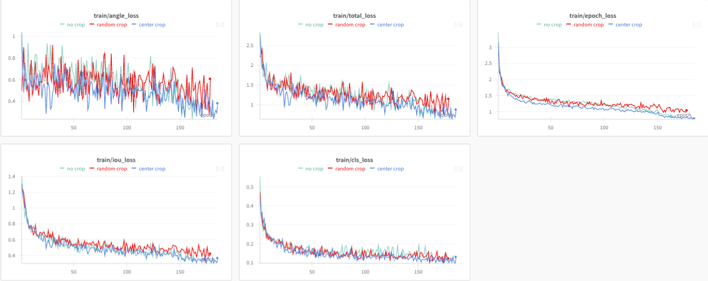
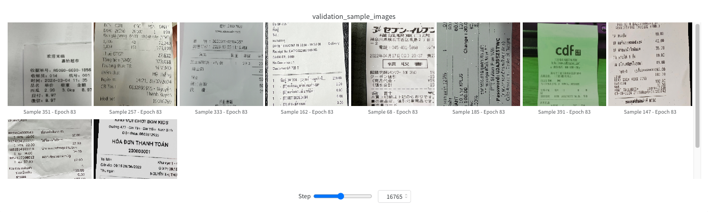

# 🚀 프로젝트 소개
> **'Data Centric**' 관점에서 모델은 VGG 고정하여 진행하였습니다.

이 프로젝트는 카메라로 촬영한 영수증 이미지에서 다국어 텍스트를 검출하는 것을 목표로 합니다. 최근 OCR 기술이 발전하면서 이미지에서 텍스트를 추출하는 다양한 솔루션이 등장했지만, 이 프로젝트에서는 모델 관점이 아닌 데이터 관점에서 문제를 해결하고자 합니다. 데이터를 최적화하여 더욱 정확하고 효율적인 텍스트 검출을 실현하는 것이 이번 프로젝트의 핵심 목표입니다.

<br>

# 💁🏼‍♂️💁‍♀️ Member 소개
| 이름       | 기여 내용 |
|------------|-----------|
| **김한별** | - Augmentation 실험진행  <br>  |
| **손지형** | - 중국어 데이터 실험진행 <br>|
| **유지환** | - TTA 및 하이퍼 파라미터 조정 실험 진행 <br>  |
| **장희진** | - Center crop 실험진행 <br> |
| **정승민** | - 깃 관리 <br>  |
| **조현준** | - 점선관련 실험 진행 <br>  |
---

<br><br>
# 🤜 팀의 목표
- Git issue를 통해 일정 관리를 진행하자!
- 데이터 관점에서 EDA를 통해 데이터 전처리 를 진행하자!
- 결과를 시각화 하여 가설을 세우고 이를 검증하자! 
- 가설 검증시 회의를 통해서 의견을 적극 제시하자!

<br><br>

# 🖥️ 프로젝트 진행 환경

### 하드웨어
- **GPU**: NVIDIA Tesla V100-SXM2 32GB
  - **메모리**: 32GB


### 소프트웨어
- **Driver Version**: 535.161.08
- **CUDA Version**: 12.2
- **Python Version**: 3.10.13
- **Deep Learning Framework**: PyTorch, CUDA 지원 활성화

<br><br>
# 🦂프로젝트 파일 구조
| Path                                | Description                  |
|-------------------------------------|------------------------------|
| `artifacts_download.ipynb`          | artifact를 다운받는 파일 |
| `code/`                             | 코드들이 저장되어있는 폴더          |
| ├── `data/`                         | 데이터들이 저장되어있는 폴더               |
| │   ├── `dataset.py`                | 데이터 Handle 함수들 정의 파일      |
| │   ├── `deteval.py`                | deteval 파일            |
| │   ├── `inference.py`              | Inference 파일             |
| │   ├── `requirements.txt`          | 환경설정 파일          |
| │   └── `train.py`                  | Training 파일      |
| `make_json.ipynb`                   | 새로운 json을 만드는 파일   |
| `readme.md`                         | Project documentation        |
| `visualization_inference.ipynb`     | 모델의 결과를 시각화 하는 파일 |

<br><br>
# 🦎필요한 라이브러리 설치
```bash
pip install -r requirements.txt
```

<br><br>
# 🦅 모델 학습 방법
*대회 규정상 baseline 코드는 .gitignore에 포함되어 현재 코드에 포함되어있지 않습니다*


### 학습 관련 인자
| 인자명                | 타입      | 기본값                  | 설명 |
|-----------------------|-----------|-------------------------|------|
| `--data_dir`          | `str`     | `'data'`               | 학습에 사용할 데이터셋 디렉토리 경로. 환경 변수 `SM_CHANNEL_TRAIN`을 먼저 참조하고, 없을 경우 기본값 사용 |
| `--model_dir`         | `str`     | `'trained_models'`     | 학습된 모델을 저장할 디렉토리 경로. 환경 변수 `SM_MODEL_DIR`을 먼저 참조하고, 없을 경우 기본값 사용 |
| `--device`            | `str`     | `'cuda'` or `'cpu'`    | 모델을 학습할 장치. CUDA가 가능하면 `'cuda'`, 아니면 `'cpu'`로 설정 |
| `--num_workers`       | `int`     | `8`                    | 데이터 로딩에 사용할 워커(worker) 프로세스 수 |
| `--image_size`        | `int`     | `2048`                 | 원본 이미지의 크기 |
| `--input_size`        | `int`     | `1024`                 | 모델에 입력할 이미지의 크기. 32의 배수여야 합니다. |
| `--batch_size`        | `int`     | `8`                    | 학습에 사용할 배치 크기 |
| `--learning_rate`     | `float`   | `1e-3`                 | 학습률 (learning rate) |
| `--max_epoch`         | `int`     | `300`                  | 최대 학습 에폭 수 |
| `--save_interval`     | `int`     | `10`                   | 몇 에폭마다 모델을 저장할지 결정 |

### Wandb 관련 인자

| 인자명                | 타입      | 기본값                  | 설명 |
|-----------------------|-----------|-------------------------|------|
| `--project_name`      | `str`     | `'이름 미지정 프로젝트'` | Wandb에 사용할 프로젝트 이름 |
| `--run_name`          | `str`     | `None`                 | Wandb 실행(run) 이름. 설정하지 않으면 현재 시간을 기준으로 자동 생성됩니다. |

### 체크포인트 및 로그 관련 인자

| 인자명                | 타입      | 기본값                  | 설명 |
|-----------------------|-----------|-------------------------|------|
| `--log_checkpoint_dir`| `str`     | `None`                 | 로그와 체크포인트 파일을 저장할 디렉토리 경로. 설정하지 않으면 현재 시간을 기준으로 생성된 이름 사용 |
| `--ckpt_path`         | `str`     | `None`                 | 사전 학습된 가중치의 경로를 지정하여 모델에 로드 |


### 사용 예시
로컬 환경에서 돌리는 경우
```
python trian.py --max_epoch 300 --save_interval 20 --project_name "Train Example Project" --run_name 'proejct test run'
```
nohup을 통해 GPU 서버 background에서 돌리는 경우 
```
nohup python trian.py --max_epoch 300 --save_interval 20 --project_name "Train Example Project" --run_name 'proejct test run' > test_output.log 2>&1 &
```

<br><br>
# 🦖 모델 추론 방법
### 명령줄 인자 설명

| 인자명                | 타입      | 기본값                  | 설명 |
|-----------------------|-----------|-------------------------|------|
| `--data_dir`          | `str`     | `'data'`               | 추론할 데이터가 포함된 디렉토리 경로. 환경 변수 `SM_CHANNEL_EVAL`을 먼저 참조하고, 없을 경우 기본값 사용 |
| `--model_dir`         | `str`     | `'trained_models'`     | 학습된 모델이 저장된 디렉토리 경로. 환경 변수 `SM_CHANNEL_MODEL`을 먼저 참조하고, 없을 경우 기본값 사용 |
| `--output_dir`        | `str`     | `'predictions'`        | 추론 결과를 저장할 디렉토리 경로. 환경 변수 `SM_OUTPUT_DATA_DIR`을 먼저 참조하고, 없을 경우 기본값 사용 |
| `--ckpt_path`         | `str`     | **필수 입력**         | 체크포인트 파일의 경로. 사전 학습된 모델 가중치를 로드하는 데 사용됩니다. |
| `--device`            | `str`     | `'cuda'` or `'cpu'`    | 추론을 수행할 장치. CUDA가 가능하면 `'cuda'`, 아니면 `'cpu'`로 설정 |
| `--input_size`        | `int`     | `2048`                 | 추론할 이미지의 입력 크기 |
| `--batch_size`        | `int`     | `5`                    | 추론 시 한 번에 처리할 이미지 배치 크기 |

### 예제 사용법


```
python inference.py --ckpt_path ./checkpoints/model.pth
```

<br><br>
# 🦖 앙상블 방법
### 명령줄 인자 설명

| 인자명                | 타입      | 기본값                  | 설명 |
|-----------------------|-----------|-------------------------|------|
| `--mode`              | `str`     | **필수 입력**           | 모드 설정. `opt` 입력 시 앙상블 파라미터 최적화, `ensemble` 입력 시 앙상블 수행 |
| `--input_dir`         | `str`     | **필수 입력**           | 앙상블 대상 output 파일들이 저장된 디렉토리 경로|
| `--output_dir`        | `str`     | **필수 입력**           | 앙상블 결과를 저장할 디렉토리 경로|
| `--iou_threshold`     | `str`     | **필수 입력**           | 앙상블 대상 output 파일들의 box를 취합 후 `iou_threshold` 이상 겹치는 box들을 하나로 병합하는 임계값 (0~1 사이 값)|
| `--vote_count`        | `str`     | **필수 입력**           | 앙상블 시 박스를 최종적으로 채택하기 위해 필요한 최소 모델 수|

### 예제 사용법


```
python ensemble.py --mode opt
python ensemble.py --mode ensemble --input_dir ./predictions --output_dir ./ensemble_result --iou_threshold 0.5 --vote_count 3
```

# 🦇wandb
<p align="center">
  
</p>


<div align="center">
  <p>
    
  </p>
  <p>
    
  </p>
</div>

---
wandb에서 cls loss, iou loss, angle loss 등을 시각화 하였고, Model에 들어가는 이미지 10장을 랜덤으로 시각화 하여 Data Augmentation이 잘 적용되었는지 시각적으로 확인을 진행하였습니다.

